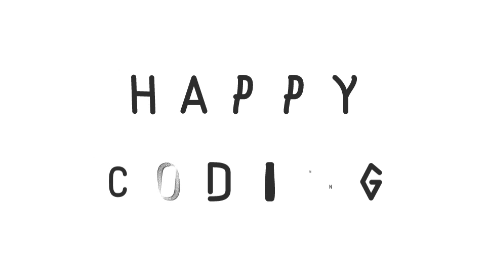

<h1 align="center">Hi There👋, I'm Brivia Allan</h1>
<h3 align="center">A passionate software engineering student from Kenya</h3>

  

- 🌱 I’m currently learning **C, Javascript, CSS, HTML, Shell**

- 💬 Ask me about **Frontend Web dev, C programming,**

- 📫 How to reach me **briviamoon@gmail.com**

<h3 align="left">Languages and Tools:</h3>

        

<h3 align="left">Github Stats</h3>

&nbsp;

<h3 align="left">Connect with me:</h3>

<h3 align="left">Support:</h3>

  
